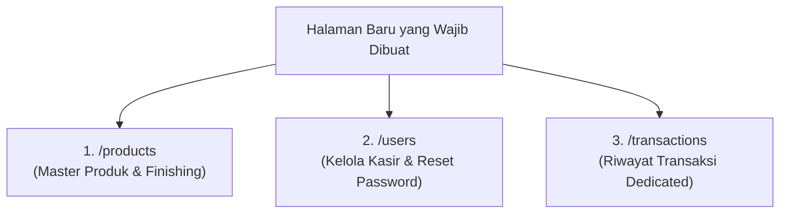

# Panduan Frontend — POS & Inventory Percetakan Perdana

Dokumen ini menyajikan pemetaan lengkap antara **apa yang SUDAH DIBUAT** (agar tidak dibuat ulang) dan **apa yang BELUM ADA & PERLU DIBUAT** pada aplikasi frontend Next.js (`apps/frontend`).

---

## 1. Ringkasan Status Halaman Frontend

| Rute Halaman | Nama Layar / Menu | Status | Keterangan |
| :--- | :--- | :--- | :--- |
| `/login` | **Login & Autentikasi** | ✅ **Sudah Selesai** | Form login JWT + HttpOnly Cookie auto-detection |
| `/` | **Dashboard Utama** | ✅ **Sudah Selesai** | Metrik ringkasan omset & pintasan cepat |
| `/pos` | **Kasir POS & Checkout** | ✅ **Sudah Selesai** | Katalog, filter kategori, keranjang, diskon, DP, invoice modal |
| `/tracking` | **Job Tracking Produksi** | ✅ **Sudah Selesai** | Kanban Board 4 kolom (`ANTRIAN` $\rightarrow$ `PROSES` $\rightarrow$ `SELESAI` $\rightarrow$ `DIAMBIL`) |
| `/inventory` | **Inventaris Bahan Baku** | ✅ **Sudah Selesai** | Tabel stok bahan, alert minimum stok, modal restock (IN/OUT), modal tambah bahan |
| `/customers` | **Data Pelanggan** | ✅ **Sudah Selesai** | Tabel pelanggan, search, modal tambah pelanggan, hapus pelanggan |
| `/reports` | **Laporan Transaksi** | ✅ **Sudah Selesai** | Filter tanggal, ringkasan omset/piutang/transaksi, tabel riwayat transaksi |
| `/products` | **Master Produk & Finishing** | ❌ **BELUM ADA** | *Wajib Dibuat*: CRUD Produk, Varian bertingkat, Add-ons, dan Kategori (*Owner only*) |
| `/users` | **Manajemen Kasir / User** | ❌ **BELUM ADA** | *Wajib Dibuat*: Tabel user, tambah kasir baru, reset password kasir (*Owner only*) |
| `/transactions`| **Riwayat Transaksi Dedicated**| ❌ **BELUM ADA** | *Wajib Dibuat*: Arsip transaksi mandiri, modal detail item/addons, cetak ulang nota |

---

## 2. Rincian Fitur & Tampilan yang SUDAH SELESAI (Jangan Dibuat Ulang!)

Berikut adalah komponen dan alur yang **sudah aktif berjalan** di codebase `apps/frontend/src/app`:

### A. Autentikasi (`/login`)
- Form login dengan input `username` & `password`.
- Menggunakan `authService.login()` yang terhubung ke backend dan otomatis menyimpan cookie `access_token` & `refresh_token`.
- State tema gelap/terang (Dark/Light mode).

### B. Kasir POS (`/pos`)
- **Katalog Produk Cetak**: Menampilkan grid produk dengan filter kategori dinamis dan pencarian nama.
- **Keranjang Belanja**: Menambah item, mengatur kuantitas, input diskon (Rp), memilih pelanggan (`Umum` atau pelanggan terdaftar).
- **Checkout Modal**: Kalkulasi total belanja, input nominal bayar (`pay_amount`), pemilihan status `PAID` (lunas) atau `DP` (uang muka), dan estimasi tanggal selesai (`estimated_done_at`).
- **Modal Sukses Checkout**: Menampilkan nomor invoice `INV-YYYYMMDD-XXXX` dan kembalian.

### C. Job Tracking Antrean Produksi (`/tracking`)
- **Kanban Board 4 Kolom**: `ANTRIAN` $\rightarrow$ `PROSES` $\rightarrow$ `SELESAI` $\rightarrow$ `DIAMBIL`.
- **1-Click Advance Status**: Tombol panah untuk memindahkan status pengerjaan secara bertahap via `transactionService.updateOrderStatus()`.
- Menampilkan nama pemesan, rincian produk, dan badge status pembayaran.

### D. Inventaris Bahan Baku (`/inventory`)
- **Tabel Stok**: Menampilkan nama bahan, varian, satuan, stok fisik, dan batas minimum stok (`min_stock_warning`).
- **Badge Status Stok**: Indikator visual stok aman vs stok menipis (kritis).
- **Modal Quick Restock**: Mencatat mutasi `IN` (stok masuk) atau `OUT` (stok keluar) langsung ke database via `rawMaterialService.createMutation()`.
- **Modal Tambah Bahan Baku Baru**: Form input bahan lengkap dengan satuan dan kategori.

### E. Manajemen Pelanggan (`/customers`)
- **Tabel Pelanggan**: Daftar nama, nomor telepon WhatsApp, alamat.
- **Search Bar**: Pencarian pelanggan secara real-time.
- **Modal Tambah Pelanggan**: Input data pelanggan baru.
- **Hapus Pelanggan**: Integrasi `customerService.deleteCustomer()`.

### F. Laporan Transaksi (`/reports`)
- Date picker filter periode tanggal.
- Ringkasan kartu: Total Omset, Transaksi Lunas, Transaksi DP, Total Piutang.
- Tabel daftar transaksi per periode.

---

## 3. Rincian 3 Halaman Baru yang BELUM ADA (Wajib Dibuat)



---

### 1. 🏷️ Halaman Master Produk & Finishing (`/products`) — *Khusus Owner (`SUPER_ADMIN`)*
* **Lokasi File**: `apps/frontend/src/app/products/page.tsx`
* **Tujuan**: Owner dapat menambah, mengubah harga, dan mengelola varian/finishing cetak tanpa menyentuh database.
* **4 Tab yang Harus Disediakan**:
  1. **Tab 1: Katalog Produk Cetak**:
     - Tabel daftar produk (`GET /products`).
     - Badge tipe harga: `FIXED` (harga tetap), `RANGE` (harga rentang min-max), `CUSTOM` (harga kesepakatan).
     - Input setting minimum order (`min_order`) dan satuan (`pcs`, `meter`, `rim`, `lembar`).
     - Modal Tambah / Edit Produk (`POST /products` & `PUT /products/{id}`).
     - Tombol Hapus Produk (`DELETE /products/{id}`).
  2. **Tab 2: Varian Produk**:
     - Memilih produk induk $\rightarrow$ menampilkan daftar variannya (`GET /products/{id}/variants`).
     - Modal Tambah Varian (`POST /products/{id}/variants`) & Edit Varian (`PUT /product-variants/{id}`).
     - Input tipe harga varian (`FIXED` vs `RANGE`).
  3. **Tab 3: Add-ons / Finishing**:
     - Master finishing cetak: Laminasi Doff/Glossy, Spot UV, Foil Emas, Jilid Spiral, Pond, Cutting (`GET /addons`).
     - Modal Tambah / Edit Add-on (`POST /addons` & `PUT /addons/{id}`).
  4. **Tab 4: Kategori Produk Cetak**:
     - CRUD Kategori Produk (`GET/POST/PUT/DELETE /product-categories`).

---

### 2. 👤 Halaman Manajemen Pengguna / Kasir (`/users`) — *Khusus Owner (`SUPER_ADMIN`)*
* **Lokasi File**: `apps/frontend/src/app/users/page.tsx`
* **Tujuan**: Owner mengelola akun karyawan/kasir, membuat akun baru, dan mereset password.
* **Elemen UI & Fitur**:
  - **Tabel User (`GET /users`)**: Nama, Username, Role (`SUPER_ADMIN` / `ADMIN`), Status Aktif.
  - **Modal Tambah Kasir Baru (`POST /users`)**:
    - Input: Nama Lengkap, Username, Password Awal (min. 8 karakter), Role (`ADMIN`).
  - **Modal Reset Password Kasir (`PATCH /users/{id}/password`)**:
    - Owner memasukkan password baru jika kasir lupa password.
  - **Tombol Nonaktifkan Akun (`DELETE /users/{id}`)**:
    - Menonaktifkan akun kasir yang sudah berhenti bekerja tanpa menghapus riwayat transaksi mereka.

---

### 3. 📜 Halaman Riwayat Transaksi Dedicated (`/transactions`)
* **Lokasi File**: `apps/frontend/src/app/transactions/page.tsx`
* **Tujuan**: Halaman mandiri untuk kasir & owner melacak seluruh transaksi penjualan dengan filter lengkap dan cetak ulang nota.
* **Elemen UI & Fitur**:
  - **Filter Bar**:
    - Search nomor invoice / nama pelanggan.
    - Filter tanggal pengerjaan.
    - Filter status pembayaran (`PAID`, `DP`, `UNPAID`).
    - Filter status pengerjaan (`ANTRIAN`, `PROSES`, `SELESAI`, `DIAMBIL`).
  - **Tabel Transaksi Server-Side Paginated (`GET /transactions`)**:
    - No Invoice, Waktu, Pelanggan, Kasir, Subtotal, Diskon, Total, Bayar, Status, Aksi.
  - **Drawer / Modal Detail Transaksi (`GET /transactions/{id}`)**:
    - Menampilkan rincian setiap item produk, varian, dan add-ons yang dibeli.
  - **Tombol Cetak Ulang Nota**:
    - Mengambil data invoice dari `GET /transactions/{id}/invoice` untuk dicetak ulang kapan saja.

---

## 4. Sub-Fitur yang Perlu Ditambahkan pada Halaman Existing

Selain 3 halaman baru di atas, berikut sub-fitur tambahan yang perlu disisipkan pada halaman yang sudah ada:

### A. Pada Halaman Laporan (`/reports`)
1. **Tab Laporan Piutang DP (`GET /reports/receivables`)**:
   - Menampilkan tabel pesanan yang belum lunas (status `DP` dan `UNPAID`) beserta kolom `remaining_amount` (sisa piutang).
   - Tombol aksi **"Lunasi Sekarang"** yang langsung membuka modal pelunasan DP.
2. **Tab Laporan Bahan Kritis / Low Stock (`GET /reports/low-stock`)**:
   - Menampilkan tabel bahan baku yang stok fisiknya $\le$ `min_stock_warning` agar segera dipesan ke supplier.
3. **Tab Top 5 Produk Terlaris (`GET /reports/top-products`)**:
   - Menampilkan produk terlaris berdasarkan kuantitas pesanan dan omset.
4. **Tab Rekap Mutasi Bahan (`GET /reports/inventory-mutations`)**:
   - Menampilkan akumulasi stok masuk (IN) vs keluar (OUT) per bahan baku.

---

### B. Pada Halaman Pelanggan (`/customers`)
1. **Drawer Riwayat Repeat Order Pelanggan (`GET /customers/{id}/transactions`)**:
   - Ketika salah satu baris pelanggan diklik, buka drawer di sisi kanan yang memuat:
     - Total akumulasi belanja pelanggan tersebut.
     - Riwayat nota belanja sebelumnya.
     - Status pesanan aktif yang sedang berjalan.

---

### C. Pada Halaman Job Tracking (`/tracking`)
1. **Modal Pelunasan DP Instan**:
   - Pada kolom Kanban **SELESAI**, sediakan tombol **"Pelunasan & Serahkan"** untuk pesanan berstatus `DP`.
   - Menampilkan sisa tagihan $\rightarrow$ Kasir input uang diterima $\rightarrow$ Submit ke `PATCH /transactions/{id}/payment` $\rightarrow$ Status transaksi otomatis menjadi `PAID` dan order berpindah ke `DIAMBIL`.

---

### D. Komponen Cetak Struk Kasir Thermal 58mm / 80mm (`/pos` & `/transactions`)
1. **Komponen Cetak Monospace (`window.print()`)**:
   - Mengambil data struk dari `GET /transactions/{id}/invoice`.
   - Header otomatis memuat info toko dari konfigurasi backend (`store_name`, `store_address`, `store_phone`).
   - Rincian item + varian + add-ons, subtotal, diskon, bayar, kembalian / sisa piutang, dan estimasi waktu selesai.
   - Menggunakan CSS `@media print` format thermal 58mm/80mm.

---

## 5. Referensi Service API Lengkap Siap Pakai

Berikut kode service Axios di `src/services/` yang siap dipanggil oleh halaman baru:

### `src/services/productService.ts`
```typescript
import { apiClient } from '../api/client';
import { ApiResponse, ListResponse } from '../types/api';
import { Product, ProductVariant, ProductAddon } from '../types/product';
import { Category } from '../types/category';

export const productService = {
  // Master Produk
  getProducts: (params?: { page?: number; search?: string; category_id?: number }) =>
    apiClient.get<ListResponse<Product>>('/products', { params }).then((r) => r.data),
  getProductById: (id: number) =>
    apiClient.get<ApiResponse<Product>>(`/products/${id}`).then((r) => r.data.data),
  createProduct: (payload: any) =>
    apiClient.post<ApiResponse<Product>>('/products', payload).then((r) => r.data.data),
  updateProduct: (id: number, payload: any) =>
    apiClient.put<ApiResponse<Product>>(`/products/${id}`, payload).then((r) => r.data.data),
  deleteProduct: (id: number) =>
    apiClient.delete(`/products/${id}`).then((r) => r.data),

  // Varian Produk
  getVariants: (productId: number) =>
    apiClient.get<ApiResponse<ProductVariant[]>>(`/products/${productId}/variants`).then((r) => r.data.data),
  createVariant: (productId: number, payload: any) =>
    apiClient.post<ApiResponse<ProductVariant>>(`/products/${productId}/variants`, payload).then((r) => r.data.data),
  updateVariant: (id: number, payload: any) =>
    apiClient.put<ApiResponse<ProductVariant>>(`/product-variants/${id}`, payload).then((r) => r.data.data),
  deleteVariant: (id: number) =>
    apiClient.delete(`/product-variants/${id}`).then((r) => r.data),

  // Add-ons & Finishing
  getAddons: () => apiClient.get<ApiResponse<ProductAddon[]>>('/addons').then((r) => r.data.data),
  createAddon: (payload: any) => apiClient.post<ApiResponse<ProductAddon>>('/addons', payload).then((r) => r.data.data),
  updateAddon: (id: number, payload: any) => apiClient.put<ApiResponse<ProductAddon>>(`/addons/${id}`, payload).then((r) => r.data.data),
  deleteAddon: (id: number) => apiClient.delete(`/addons/${id}`).then((r) => r.data),

  // Kategori Produk
  getCategories: () => apiClient.get<ApiResponse<Category[]>>('/product-categories').then((r) => r.data.data),
};
```

### `src/services/userService.ts`
```typescript
import { apiClient } from '../api/client';
import { ApiResponse, ListResponse } from '../types/api';
import { User, CreateUserPayload, UpdateUserPayload } from '../types/user';

export const userService = {
  getUsers: (params?: { page?: number; search?: string; role?: string }) =>
    apiClient.get<ListResponse<User>>('/users', { params }).then((r) => r.data),
  createUser: (payload: CreateUserPayload) =>
    apiClient.post<ApiResponse<User>>('/users', payload).then((r) => r.data.data),
  updateUser: (id: number, payload: UpdateUserPayload) =>
    apiClient.put<ApiResponse<User>>(`/users/${id}`, payload).then((r) => r.data.data),
  resetPassword: (id: number, password: string) =>
    apiClient.patch(`/users/${id}/password`, { password }).then((r) => r.data),
  deactivateUser: (id: number) =>
    apiClient.delete(`/users/${id}`).then((r) => r.data),
};
```

### `src/services/customerService.ts` (Ditambah `getCustomerTransactions`)
```typescript
import { apiClient } from '../api/client';
import { ApiResponse, ListResponse } from '../types/api';
import { Customer } from '../types/customer';
import { Transaction } from '../types/transaction';

export const customerService = {
  getCustomers: (params?: { search?: string; page?: number }) =>
    apiClient.get<ListResponse<Customer>>('/customers', { params }).then((r) => r.data),
  createCustomer: (payload: Partial<Customer>) =>
    apiClient.post<ApiResponse<Customer>>('/customers', payload).then((r) => r.data.data),
  updateCustomer: (id: number, payload: Partial<Customer>) =>
    apiClient.put<ApiResponse<Customer>>(`/customers/${id}`, payload).then((r) => r.data.data),
  deleteCustomer: (id: number) =>
    apiClient.delete(`/customers/${id}`).then((r) => r.data),
  getCustomerTransactions: (customerId: number, params?: { page?: number }) =>
    apiClient.get<ListResponse<Transaction>>(`/customers/${customerId}/transactions`, { params }).then((r) => r.data),
};
```

### `src/services/reportService.ts` (Ditambah Piutang & Low Stock)
```typescript
import { apiClient } from '../api/client';
import { ApiResponse } from '../types/api';
import { DashboardSummary, DailySalesItem, TopProductItem, InventoryMutationItem, ReceivableItem, LowStockItem } from '../types/report';

export const reportService = {
  getSummary: (params?: { start_date?: string; end_date?: string }) =>
    apiClient.get<ApiResponse<DashboardSummary>>('/reports/summary', { params }).then((r) => r.data.data),
  getDailySales: (params?: { start_date?: string; end_date?: string }) =>
    apiClient.get<ApiResponse<DailySalesItem[]>>('/reports/daily-sales', { params }).then((r) => r.data.data),
  getTopProducts: (params?: { start_date?: string; end_date?: string }) =>
    apiClient.get<ApiResponse<TopProductItem[]>>('/reports/top-products', { params }).then((r) => r.data.data),
  getInventoryMutations: (params?: { start_date?: string; end_date?: string }) =>
    apiClient.get<ApiResponse<InventoryMutationItem[]>>('/reports/inventory-mutations', { params }).then((r) => r.data.data),
  getReceivables: (params?: { start_date?: string; end_date?: string }) =>
    apiClient.get<ApiResponse<ReceivableItem[]>>('/reports/receivables', { params }).then((r) => r.data.data),
  getLowStock: () =>
    apiClient.get<ApiResponse<LowStockItem[]>>('/reports/low-stock').then((r) => r.data.data),
};
```

---

## 6. Sidebar Navigation Update (`src/components/layout/Sidebar.tsx`)

Tambahkan menu baru ke dalam array `menuItems` di `Sidebar.tsx`:

```typescript
const menuItems = [
  { name: 'Dashboard', icon: LayoutDashboard, path: '/' },
  { name: 'Kasir POS', icon: ShoppingCart, path: '/pos' },
  { name: 'Job Tracking', icon: ClipboardList, path: '/tracking' },
  { name: 'Riwayat Transaksi', icon: History, path: '/transactions' }, // [BARU]
  { name: 'Master Produk', icon: Tag, path: '/products', role: 'SUPER_ADMIN' }, // [BARU]
  { name: 'Inventaris Bahan', icon: Package, path: '/inventory' },
  { name: 'Pelanggan', icon: Users, path: '/customers' },
  { name: 'Laporan', icon: FileText, path: '/reports' },
  { name: 'Kelola Kasir', icon: UserCog, path: '/users', role: 'SUPER_ADMIN' }, // [BARU]
];
```

---

## 7. Checklist Pengerjaan Frontend Selanjutnya

- [ ] **1. Buat Halaman `/products`**: 4 Tab (Produk Cetak, Varian, Finishing, Kategori) — *Khusus Owner*.
- [ ] **2. Buat Halaman `/users`**: Tabel Akun Kasir, Tambah User, dan Reset Password — *Khusus Owner*.
- [ ] **3. Buat Halaman `/transactions`**: Arsip Riwayat Transaksi Dedicated & Modal Detail Transaksi.
- [ ] **4. Lengkapi Halaman `/reports`**: Tambahkan Tab Piutang DP (`/reports/receivables`) & Tab Bahan Kritis (`/reports/low-stock`).
- [ ] **5. Lengkapi Halaman `/customers`**: Tambahkan Drawer Riwayat Repeat Order (`/customers/{id}/transactions`).
- [ ] **6. Lengkapi Modal Pelunasan DP di `/tracking` & Komponen Print Nota Thermal di `/pos`**.
- [ ] **7. Update Menu Sidebar di `Sidebar.tsx`**.
