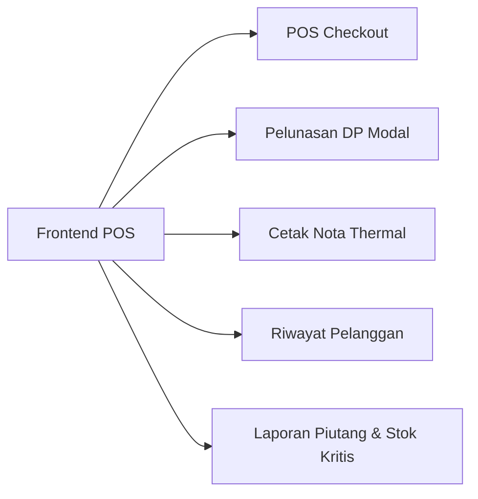

# Ringkasan Audit API & Rekomendasi Fitur Perdana POS

Dokumen ini merangkum status seluruh API backend yang telah selesai dibuat serta pembagian hak akses (RBAC), konfigurasi, dan panduan fitur lanjutan untuk aplikasi **Perdana POS & Percetakan**.

---

## 1. Pembagian Hak Akses Role (RBAC)

Sistem menggunakan 2 level hak akses yang disesuaikan dengan peran kerja di percetakan:

| Role | Peran / Jabatan | Hak Akses & Wewenang |
| :--- | :--- | :--- |
| **`SUPER_ADMIN`** | **Owner / Pemilik Toko** | • Akses penuh ke seluruh menu & data.<br>• Manajemen pengguna (CRUD user, reset password kasir, nonaktifkan akun).<br>• CRUD master katalog produk, varian harga, add-ons, dan kategori.<br>• CRUD master bahan baku inventaris.<br>• Hapus data pelanggan.<br>• Akses semua laporan omset, piutang, dan analitik performa tanpa batasan tanggal. |
| **`ADMIN`** | **Kasir / Operator Percetakan** | • Operasional Kasir POS (buat transaksi, hitung diskon, input DP, cetak nota).<br>• Job Tracking & Status Produksi (`ANTRIAN` $\rightarrow$ `PROSES` $\rightarrow$ `SELESAI` $\rightarrow$ `DIAMBIL`).<br>• Pelunasan pembayaran (update payment DP / lunas).<br>• Input mutasi stok bahan baku (IN / OUT).<br>• Tambah & edit data pelanggan + lihat riwayat repeat order pelanggan.<br>• Akses baca produk, varian, dan add-ons untuk transaksi kasir.<br>• Melihat laporan harian operasional. |

---

## 2. Status Kesiapan Seluruh API Backend (26 Endpoint)

Seluruh endpoint berikut telah diimplementasikan, terdokumentasi di Swagger UI (`/swagger-ui/`), dan tervalidasi dengan Automated Integration Tests:

| Modul | Endpoint | Metode | Role Akses | Keterangan |
| :--- | :--- | :--- | :--- | :--- |
| **Autentikasi** | `/api/v1/auth/login` | `POST` | Publik | Login JWT + Pasang HttpOnly Cookie |
| | `/api/v1/auth/refresh` | `POST` | Publik / Cookie | Perpanjang JWT access token |
| | `/api/v1/auth/logout` | `POST` | Authenticated | Hapus cookie token & akhiri sesi |
| | `/api/v1/auth/me` | `GET` | Authenticated | Data profil user yang sedang login |
| **Manajemen User** | `/api/v1/users` | `GET` | Super Admin (Owner) | Daftar semua user & pagination |
| | `/api/v1/users` | `POST` | Super Admin (Owner) | Tambah akun kasir/admin baru |
| | `/api/v1/users/{id}` | `GET` | Super Admin (Owner) | Detail profil user |
| | `/api/v1/users/{id}` | `PUT` | Super Admin (Owner) | Ubah nama, role, status aktif |
| | `/api/v1/users/{id}/password` | `PATCH` | Super Admin (Owner) | Reset password akun kasir |
| | `/api/v1/users/{id}` | `DELETE` | Super Admin (Owner) | Nonaktifkan akun kasir (soft-deactivate) |
| **Kategori & Katalog** | `/api/v1/product-categories` | `GET` / `POST` / `PUT` / `DELETE` | Read: All, Write: Owner | Master kategori produk cetak |
| | `/api/v1/raw-material-categories` | `GET` / `POST` / `PUT` / `DELETE` | Read: All, Write: Owner | Master kategori bahan baku |
| | `/api/v1/products` | `GET` / `POST` / `PUT` / `DELETE` | Read: All, Write: Owner | Master produk (Fixed/Range/Custom price) |
| | `/api/v1/products/{id}/variants` | `GET` / `POST` | Read: All, Write: Owner | Varian produk cetak |
| | `/api/v1/product-variants/{id}` | `PUT` / `DELETE` | Super Admin (Owner) | Edit / hapus varian produk |
| | `/api/v1/addons` | `GET` / `POST` / `PUT` / `DELETE` | Read: All, Write: Owner | Master add-ons / finishing percetakan |
| **Inventaris Bahan** | `/api/v1/raw-materials` | `GET` / `POST` / `PUT` / `DELETE` | Read: All, Write: Owner | Master bahan baku & alert batas minimum |
| | `/api/v1/raw-materials/mutations` | `POST` | All (Kasir & Owner) | Catat mutasi stok masuk (IN) / keluar (OUT) |
| | `/api/v1/raw-materials/{id}/mutations` | `GET` | All (Kasir & Owner) | Riwayat mutasi per bahan baku |
| **Pelanggan** | `/api/v1/customers` | `GET` / `POST` / `PUT` | All (Kasir & Owner) | Daftar, cari, tambah, update pelanggan |
| | `/api/v1/customers/{id}` | `DELETE` | Super Admin (Owner) | Hapus pelanggan |
| | `/api/v1/customers/{id}/transactions` | `GET` | All (Kasir & Owner) | **[BARU]** Riwayat repeat order pelanggan |
| **Transaksi & POS** | `/api/v1/transactions` | `GET` / `POST` | All (Kasir & Owner) | Buat pesanan baru atomik & riwayat POS |
| | `/api/v1/transactions/{id}` | `GET` | All (Kasir & Owner) | Detail transaksi lengkap beserta items & addons |
| | `/api/v1/transactions/{id}/status` | `PATCH` | All (Kasir & Owner) | Update status pengerjaan (`ANTRIAN` $\rightarrow$ `DIAMBIL`) |
| | `/api/v1/transactions/{id}/payment` | `PATCH` | All (Kasir & Owner) | Pelunasan tagihan / pembayaran DP |
| | `/api/v1/transactions/{id}/invoice` | `GET` | All (Kasir & Owner) | Data cetak nota thermal (info toko dari `.env`) |
| **Laporan & Analytics** | `/api/v1/reports/summary` | `GET` | All (Kasir & Owner) | Ringkasan omset, piutang, order aktif & stok |
| | `/api/v1/reports/daily-sales` | `GET` | All (Kasir & Owner) | Grafik tren omset & total transaksi harian |
| | `/api/v1/reports/top-products` | `GET` | All (Kasir & Owner) | Rangking produk terlaris & revenue |
| | `/api/v1/reports/inventory-mutations`| `GET` | All (Kasir & Owner) | Rekap agregasi stok masuk & keluar |
| | `/api/v1/reports/receivables` | `GET` | All (Kasir & Owner) | **[BARU]** Daftar piutang DP & tagihan tertunda |
| | `/api/v1/reports/low-stock` | `GET` | All (Kasir & Owner) | **[BARU]** Daftar bahan baku menipis / kritis |

---

## 3. Konfigurasi Toko Dinamis (Environment Variables)

Informasi toko untuk cetak struk/nota kasir tidak lagi di-hardcode, melainkan dapat diatur secara fleksibel pada file `.env`:

```env
STORE_NAME="PERDANA PRINTING & POS"
STORE_ADDRESS="Jl. Percetakan Perdana No. 1, Kota"
STORE_PHONE="0812-3456-7890"
```

---

## 4. Rekomendasi Fitur Frontend Siap Pakai

Berikut alur integrasi frontend yang disarankan untuk memaksimalkan fitur backend:



1. **Modal Pelunasan DP (Halaman Laporan / Job Tracking)**:
   - Gunakan `GET /api/v1/reports/receivables` untuk menampilkan tabel transaksi yang belum lunas.
   - Klik tombol "Lunasi" $\rightarrow$ buka modal input jumlah bayar $\rightarrow$ submit ke `PATCH /api/v1/transactions/{id}/payment`.

2. **Kalkulator Spanduk / Banner (Halaman POS)**:
   - Untuk produk dengan `price_type = "CUSTOM"`, sediakan input kalkulator: $\text{Panjang} \times \text{Lebar} \times \text{Harga/m}^2$.
   - Hasil perhitungan dikirim ke field `custom_price` pada item payload `POST /api/v1/transactions`.

3. **Cetak Nota Kasir 58mm / 80mm**:
   - Panggil `GET /api/v1/transactions/{id}/invoice`, render struk berbasis HTML/CSS thermal monospace, dan picu `window.print()`.

4. **Widget Notifikasi Stok Kritis di Header Dashboard**:
   - Panggil `GET /api/v1/reports/low-stock` saat user login; jika ada data, tampilkan badge peringatan merah di header untuk segera restock bahan.
